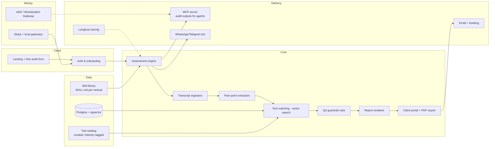

# Deep Research 05 — Converting the Service into SaaS (how, what to use, why)

> Stream: `ai-tools-assessment-2026-08-13` · Date: 2026-08-13
> Leverages: this stream's prompt pack (02), the OSS research (04), and the sibling stream's Zaher.AI case study + x402/Monetization-Gateway findings (`cloudflare-agent-internet-2026-08-12/00_MASTER_SYNTHESIS.md`).

---

## 1. Why convert — and why NOT yet (the evidence-based sequencing)

**Evidence that conversion works (from the sibling research):** **Zaher.AI** (Cairo, 2025) is the living proof that this exact category productizes: 8 modules, 20+ paying brands, 100% retention, EGP pricing, $7.99 entry tier, agency channel. It productized *AI-visibility auditing*. The gap it leaves (no MCP server, no WhatsApp bot, no Arabic-LLM coverage, shallow free tier) is the map for a clone/competitor.

**Evidence that the service must come first:** the phase-2 skill only reaches copy-paste quality after 4–6 real audits (episode 10:33–11:20) — i.e., **the SaaS engine is trained by the service**. Each $999 audit is a paid customer interview that also funds the build. Corey himself ran the service for 15+ audits before he had a stack worth productizing.

**The conversion trigger (all must be true):**
1. ≥10 completed audits in ONE vertical (patterns repeat: same pains, same tools, same report structure).
2. The phase-2 skill runs at copy-paste quality (substitution rate near zero).
3. You have a defensible niche (geography or vertical) with a known ICP.
4. You can name the ONE automated loop that replaces your manual work (usually: analysis → report; the call stays human).

---

## 2. The business model blueprint (from the Zaher playbook + this playbook)

| Layer | Service phase (now) | SaaS phase (productized) | Zaher.AI evidence |
|---|---|---|---|
| Entry offer | $999 assessment | **Free 60s audit** (lead gen) + $X/mo tiers | Free audit → $7.99 Discovery |
| Core product | 9-slide report | Self-serve audit engine + dashboard + recommendations | GEO modules, Optimization Hub |
| Expansion | Upsell menu (redesign/automation/knowledge/skills) | **Add-on marketplace** ($9.99–$249/mo modules) | Add-ons: SEO engine, query booster, competitor tracking |
| Recurring | Concierge $1.2–2K/mo (cap 6) | Subscriptions (3 tiers) + usage/query packs | 3 paid plans |
| Channel | Meetups, office hours, referrals | **Agency program** (white-label per-domain, 10–20% margin, workshops) | Agency Plan + workshops at 6 clients |
| Payments | Stripe/invoice | **Local-currency billing first** (EGP/SAR/AED) + Stripe | EGP-primary, USD/SAR reference |
| Future rails | — | **x402 / Monetization Gateway** so agents pay per-crawl/per-report | Rails live since 2026-07 (Linux Foundation) |

**The productized pricing ladder (proposal):**
- **Free** — 60-second mini audit: 1 pain → 1 tool + teaser (the `02_prompt_pack.md` #11 prompt, automated)
- **Starter $19–29/mo** — 3 audits/mo, report + 4-day plan, 1 industry
- **Growth $79–99/mo** — unlimited audits, full report + major-project seeding, priority tools, WhatsApp alerts
- **Agency / white-label** — multi-tenant dashboards for agencies managing 10–30 client domains (this is where Zaher's agency channel wins; copy it)
- **Enterprise** — custom models (Arabic LLMs), SSO, SLA

---

## 3. Architecture (the assessment engine)



**Pipeline detail (each step maps to a prompt from `02_prompt_pack.md`):**
1. **Ingestion** — client uploads recording or pastes transcript (self-hosted whisper.cpp option) → normalized transcript.
2. **Extraction** — pain points + levers + hours estimates (prompt #2, but structured: strict JSON schema, `gurantee_flag` when <5 hrs).
3. **Tool matching** — hybrid: vector search over the curated tool catalog (embeddings on tool descriptions + industry tags) + rule filters (budget ≤ client size, setup ≤ 2 hrs for quick wins) + LLM re-rank. The QA rules (prompt #3) become **hard validation code**, not prompt language — deterministic, testable.
4. **Report render** — prompt #4 + #5 → markdown → Marp/Typst PDF or Claude Design export; 4-day plan auto-generated.
5. **Delivery** — portal + email; review call still human (that's where upsells live).
6. **Agent access (the differentiator)** — every finished audit exports as MCP-accessible JSON + a stable URL: *"AI-ready audit reports"*. Only 4/23 GEO vendors ship MCP; no assessment service does (verified gap in sibling research).

---

## 4. Tech stack — what to use and why

| Layer | Choice | Why (evidence-backed) |
|---|---|---|
| Frontend | **Next.js (App Router) + Tailwind + shadcn/ui** | Fastest path to auth/portal/dashboard; Vercel deploy; Dify itself is Next-based |
| Backend/API | **Hono or Fastify (TS)** on same repo; or **FastAPI** if Python-first for the AI layer | AI SDKs are TS/Python; keep one language |
| DB | **Postgres + pgvector** (Supabase or Neon) | Relational clients/plans + vector search for tool catalog in one place |
| Auth | **Clerk** (or Supabase Auth) | Multi-tenant agencies need orgs/RBAC from day 1 |
| AI orchestration | **Claude API + Agent SDK**; your skills uploaded via Skills API; **Dify (OSS, self-host)** as the visual workflow layer if you want to avoid coding the pipeline | The entire phase-2 prompt pack is already skill-shaped (anthropics/skills spec); Dify = drag-drop version of the same logic |
| Job queue | **Inngest or trigger.dev** | Long-running audits (analysis + web research) need retries/observability |
| Object storage | **Cloudflare R2 or S3** | Report PDFs, transcripts, client files |
| Email | **Resend** | Report delivery + follow-ups |
| Payments | **Stripe** + local gateways (Paymob/Fawry for Egypt 🔶; PayTabs for GCC 🔶) | Zaher evidence: local-currency billing is the #1 conversion lever outside USD markets |
| Observability | **Langfuse (OSS, self-host)** | Trace every audit run; the eval feedback loop (prompt #12) needs production traces |
| Model inference (cost control) | Frontier API (Claude) for analysis; **Ollama/whisper.cpp** for STT and cheap extraction steps | Keep $0.50–$1.50 cost per audit run — that's the SaaS gross-margin enabler |
| Agent delivery | **OpenClaw + WhatsApp channel** for client-facing bot; **MCP server** for report exports | MENA-native UX + the agent-economy wedge |
| Deploy | **Cloudflare Workers/Pages + R2** (or Vercel) | Sibling research: Cloudflare is the agent-internet stack (AI Crawl Control, Monetization Gateway, x402-friendly) |

---

## 5. The moat: the curated tool catalog

The SaaS competitor (Profound/Goodie/Evertune) sells measurement. **Your moat is the curated prescription database** — tools tagged by industry, price, setup time, hours saved, lever, free-tier, and *observed success* from your own audits:

```json
{
  "tool_id": "sanebox",
  "name": "SaneBox",
  "category": "AI|SaaS",
  "industries": ["*"],
  "pains": ["email_overload", "inbox_management"],
  "monthly_cost_usd": 12,
  "setup_minutes": 10,
  "hours_saved_per_week": 2,
  "lever": "efficiency",
  "free_tier": true,
  "client_size_max": 200,
  "verified_at": "2026-08-13",
  "audit_success_rate": 0.91
}
```

**Why this wins:** the QA substitution rules (prompt #3) encode judgment ("never Salesforce for a 4-person landscaping company") — as the catalog grows per vertical, the engine gets *more* correct while competitors' generic LLM output stays flat. This is the productized version of Corey's "feed transcripts + reports back into the skill" loop. Curation workflow: every delivered audit's final recommendations are merged back into the catalog (the prompt #12 feedback loop, automated).

---

## 6. Localization — the two proven wedges

- **Arabic-first (MENA):** the repo's home turf and Zaher.AI's proof. Arabic UI + EGP/SAR billing + WhatsApp bot + Arabic-LLM audit coverage (Jais, Fanar, ALLAM — Zaher gap #5). No service-layer competitor verified (03, whitespace map).
- **Spanish-first (LatAm/Spain):** the sibling research's **largest whitespace** — 500M+ speakers, mature e-commerce, zero incumbent, ~22 OSS GEO repos to fork. Mirror Zaher: local currency, agency channel, free audit.
- Rule from both: **localize pricing and payments before features.** Under-cutting by 10–50× (Zaher's $7.99 vs Profound's $99) is a deliberate conversion lever.

---

## 7. MVP plan + cost (8 weeks, solo/small team)

| Week | Deliverable | Stack used |
|---|---|---|
| 1–2 | Landing + free mini-audit (one prompt, one industry) + Stripe | Next.js, prompt #11 |
| 3–4 | Assessment engine v1: upload/paste transcript → analysis JSON → report PDF | Claude API + skills, prompt #2–5 |
| 5 | QA rules as code + tool catalog seed (50 tools, 1 industry) | Postgres+pgvector, prompt #3 |
| 6 | Portal: client login, report history, review-call booking | Supabase/Clerk + Cal.com-style embed |
| 7 | WhatsApp alerts + MCP export of audits | OpenClaw/MCP server |
| 8 | Agency multi-tenant skeleton + Langfuse tracing | Org/RBAC, prompt #12 loop |

**Costs (verified-ish):** infra $100–300/mo (Vercel/CF + Postgres + R2 + Langfuse self-host on a $20 VPS); AI ~$0.50–1.50/audit run; total pre-launch ≈ **$1–2K cash** + your time. Compare: Zaher-class MVP $80K–$150K was the sibling research's estimate for the Spanish-first GEO clone — **the assessment SaaS is a fraction of that because the pipeline is already built and prompt-tested in the service phase.**

**Build vs no-code:** if you don't code, the OSS path is n8n (or Dify) + anything-llm + OpenClaw glued by webhooks — prompts #2–5 become workflow nodes. Slower, less controlled, but zero-code. The code path above is ~600–1,000 lines of real logic, not AI-glorified config.

---

## 8. Risks (honest)

1. **Incumbent absorption** — Profound/Goodie/Evertune localize (they haven't; Spanish/Arabic gaps are real as of 2026-08-12) → speed matters; the window for language-first clones is 12–18 months (sibling research).
2. **Prompt non-determinism** — mitigated by QA-as-code: rule-based validation + catalog constraints, LLM only for extraction/ranking. Never ship the guarantee without the rules.
3. **The human call is the funnel** — a self-serve SaaS loses the review call where 50–60% upsells happen. Design the SaaS to *sell* the human review call (it becomes a paid add-on), not to replace it.
4. **Model cost creep** — web-research steps are the expensive part; cache, batch, and use small models for extraction.
5. **Data privacy** — transcripts are PII-bearing; EU/MENA data rules → self-hosted STT + R2 in-region is the selling point, not the cost center.

**Next:** `06_llm_agent_guide.md` — the final guide/instruction set for LLMs and agents to operate this entire system.
